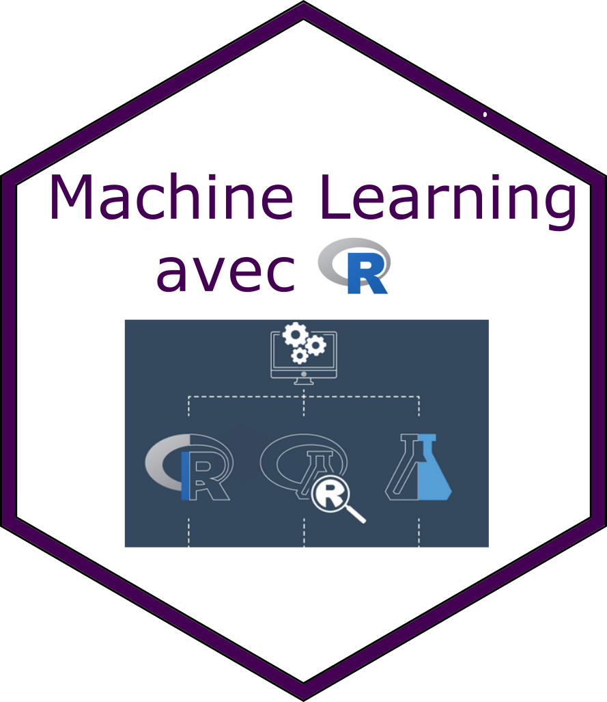
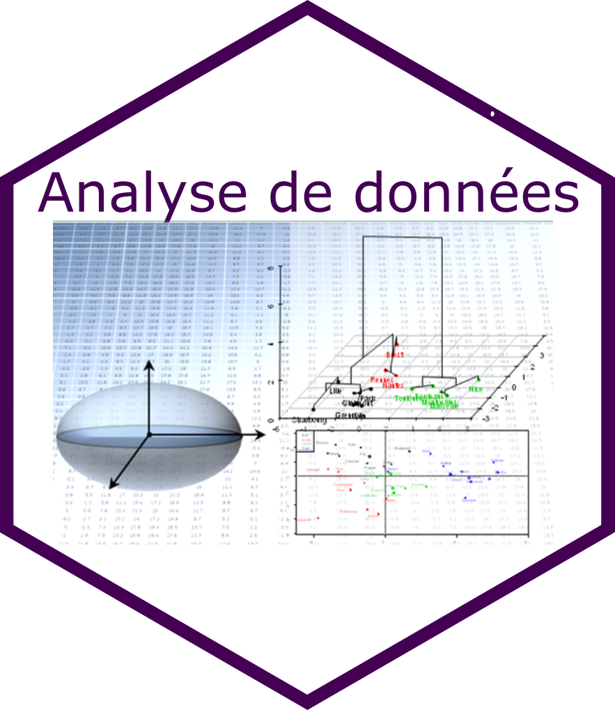

```{r setup_teaching, include=FALSE}
knitr::opts_chunk$set(echo = TRUE, cache = TRUE)
library(leaflet)
library(tidyverse)
library(ggplot2)
```


## Les formations


|  |  |  |  
|:--------------:|:--------------:|:--------------:|
|[</img>  ](manipvisu.html)   |   [</img>  ](modelelineaire.html) |[</img>  ](machinelearning.html)  | 
| **Manipulation et**  \ **visualisation de données**  | **Démarche statistique et modèles linéaires avec R** | **Machine learning avec R** |
[</img>  ](add.html)|  [](senso.html)| |
|**Analyse de données **|**Sensométrie** \ **avec R**| |
  
## L'équipe

Les formateurs sont des enseignants chercheurs et des ingénieurs au sein du département Statistique et Informatique d'Agrocampus Ouest. Ils participent tous à la formation initiale des étudiants ingénieurs et ont une activité de recherche dans le domaine des statistiques appliquées. 


## Informations générales

Pour toute information concernant les inscriptions, contacter le service de formation continue d'Agrocampus Ouest :
[formco@agrocampus-ouest.fr](formco@agrocampus-ouest.fr)

### En savoir plus 

[Programme de la formation continue à Agrocampus Ouest](http://formationcontinue.agrocampus-ouest.fr/infoglueDeliverLive/)


## L'école

Les formations sont dispensées à [Agrocampus Ouest, Rennes](https://www.agrocampus-ouest.fr/).

```{r, echo=FALSE}
df <- tibble(long = -1.71, lat = -48.114, name='ACO - Bat 24' )
m <- leaflet() %>%
     setView(lng =-1.71, lat = 48.114, zoom = 15)
m %>%
     addTiles()
```

