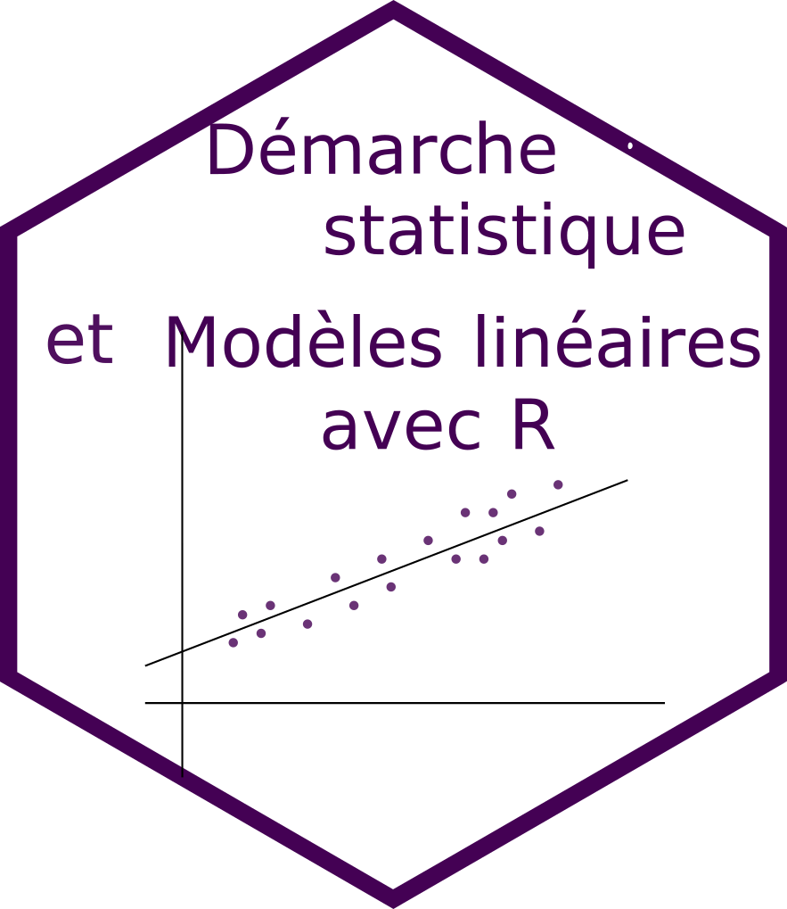
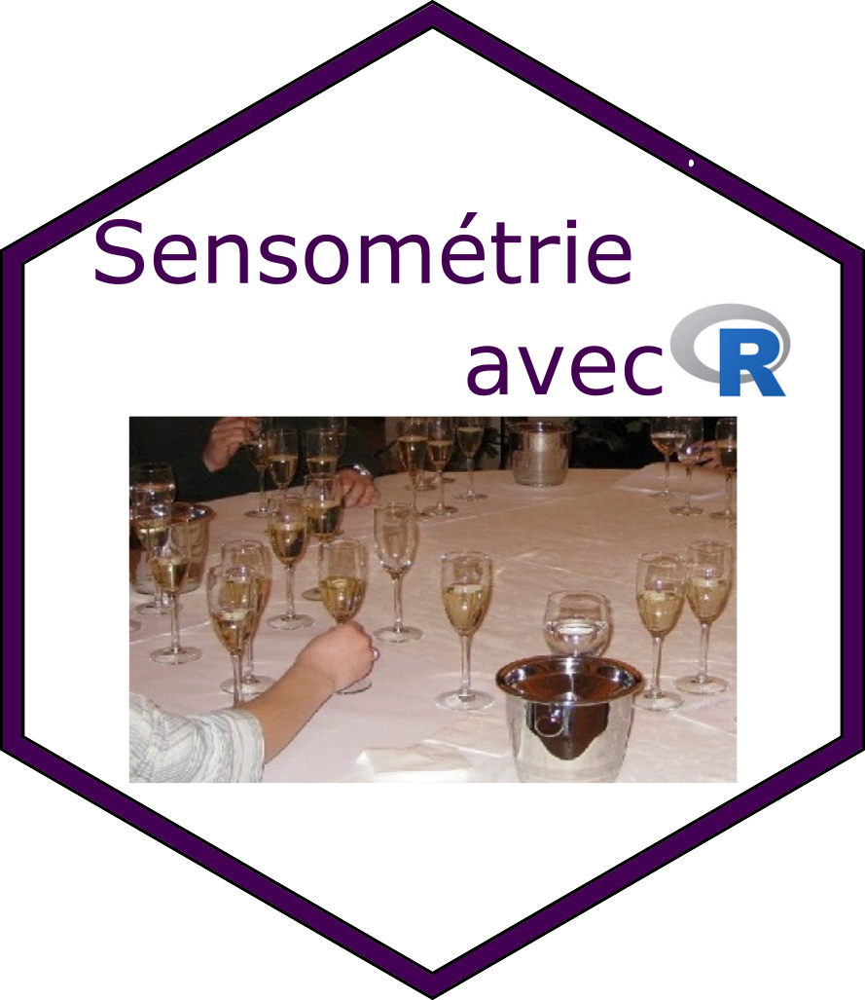

```{r setup_teaching, include=FALSE}
knitr::opts_chunk$set(echo = TRUE, cache = TRUE)
library(leaflet)
library(tidyverse)
library(ggplot2)
```


## L'équipe

Les formateurs sont des enseignants chercheurs et des ingénieurs au sein du département Mathématique et Informatique d'Agrocampus Ouest. Ils participent tous à la formation initiale des étudiants ingénieurs et ont une activité de recherche dans le domaine des statistiques appliquées. 


- [David Causeur](math.agrocampus-ouest.fr/infoglueDeliverLive/membres/david.causeur)
- [Mathieu Emily](http://emily.perso.math.cnrs.fr/Mathieu_EMILYs_homepage/Home.html)
- [Marie-Pierre Etienne](http://mpetienne.org)
- [Magalie Houée-Bigot](http://math.agrocampus-ouest.fr/infoglueDeliverLive/membres/Magalie.Hou%C3%A9e-Bigot)
- [François Husson](https://husson.github.io/)
- [Sébastien Lé](http://sebastien.ledien.free.fr/me.html)

## Les formations


|  |  |  |  |
|:--------------:|:--------------:|:--------------:|:--------------:|
|[</img>  ](manipvisu.html)   |   [</img>  ](modelelineaire.html) |[</img>  ](add.html)|  [](senso.html)   |
| **Manipulation et**  \ **visualisation de données**  | **Démarche statistique et modèles linéaires avec R** | **Analyse de données** |  **Sensométrie** \ **avec R**|
|[</img>  ](machinelearning.html)  | | | |
|**Machine learning avec R** | | | |


## L'école

Les formations sont dispensées à Agrocampus Ouest, Rennes.

```{r, echo=FALSE}
df <- tibble(long = -1.71, lat = -48.114, name='ACO - Bat 24' )
m <- leaflet() %>%
     setView(lng =-1.71, lat = 48.114, zoom = 15)
m %>%
     addTiles()
```

